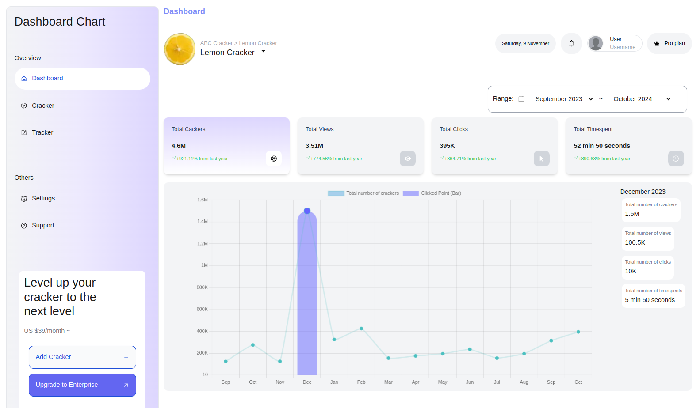

# Dashboard Chart

[http://dashboard-chart.smmuja.com](http://dashboard-chart.smmuja.com)

## Overview

The Dashboard Chart is a web application built with Next.js and TypeScript, designed to provide insightful metrics through visually appealing charts. It utilizes Chart.js for data visualization and Tailwind CSS for styling, offering a responsive and modern user interface.

## Tech Stack

- **Next.js**: A React framework for building server-rendered applications.
- **TypeScript**: A superset of JavaScript that adds static types for better tooling and error checking.
- **Chart.js**: A powerful library for creating interactive and customizable charts.
- **Tailwind CSS**: A utility-first CSS framework for rapid UI development.

## Features

- **Dashboard Chart**: Visual representation of various metrics.
- **Metrics Card**: Select cards based on different metrics for easy comparison.
- **Date Selection**: View metrics for a specific date or across a defined date range.

## Preview



## Folder Structure

The project follows a modular folder structure to ensure scalability and maintainability:

```
src/
├── components              (Shared components)
│   └── base                (Reusable base components like Button, IconLink, etc.)
├── features                (Feature-specific components for building pages)
├── layout                  (Layout components, e.g., Header, Footer, Main Layout)
├── data                    (Static data or mock data files)
├── utils                   (Utility functions and helper modules)
├── hooks                   (Custom React hooks for shared logic)
└── assets                  (Images, icons, and other static assets)

```

## Metrics Chart

The metrics chart displays the following data points:

- **Total Cracker**: The total number of crackers used.
- **View**: The total views received.
- **Click**: The total clicks on the dashboard.
- **Time Spent**: The total time spent interacting with the dashboard.

## Future Improvements

### Authentication

- **Login/Register Functionality**: Adding user authentication to allow users to create accounts and log in to view personalized data or save their settings.

### Enhanced Data Filtering

- **Advanced Filtering Options**: Allow users to filter data by additional parameters such as categories or custom date ranges (Calendar library)

## How to Run Locally

### Prerequisites

Ensure you have the following installed on your machine:

- **Node.js**: Download and install from [nodejs.org](https://nodejs.org/).
- **Yarn**: Package manager to manage dependencies. Install it from [yarnpkg.com](https://yarnpkg.com/).

This is a [Next.js](https://nextjs.org) project bootstrapped with [`create-next-app`](https://nextjs.org/docs/pages/api-reference/create-next-app).

## Getting Started

First, run the development server:

```bash
npm run dev
# or
yarn dev
# or
pnpm dev
# or
bun dev
```

Open [http://localhost:3000](http://localhost:3000) with your browser to see the result.

You can start editing the page by modifying `pages/index.tsx`. The page auto-updates as you edit the file.

[API routes](https://nextjs.org/docs/pages/building-your-application/routing/api-routes) can be accessed on [http://localhost:3000/api/hello](http://localhost:3000/api/hello). This endpoint can be edited in `pages/api/hello.ts`.

The `pages/api` directory is mapped to `/api/*`. Files in this directory are treated as [API routes](https://nextjs.org/docs/pages/building-your-application/routing/api-routes) instead of React pages.

This project uses [`next/font`](https://nextjs.org/docs/pages/building-your-application/optimizing/fonts) to automatically optimize and load [Geist](https://vercel.com/font), a new font family for Vercel.

## Learn More

To learn more about Next.js, take a look at the following resources:

- [Next.js Documentation](https://nextjs.org/docs) - learn about Next.js features and API.
- [Learn Next.js](https://nextjs.org/learn-pages-router) - an interactive Next.js tutorial.

You can check out [the Next.js GitHub repository](https://github.com/vercel/next.js) - your feedback and contributions are welcome!

## Deploy on Vercel

The easiest way to deploy your Next.js app is to use the [Vercel Platform](https://vercel.com/new?utm_medium=default-template&filter=next.js&utm_source=create-next-app&utm_campaign=create-next-app-readme) from the creators of Next.js.

Check out our [Next.js deployment documentation](https://nextjs.org/docs/pages/building-your-application/deploying) for more details.
